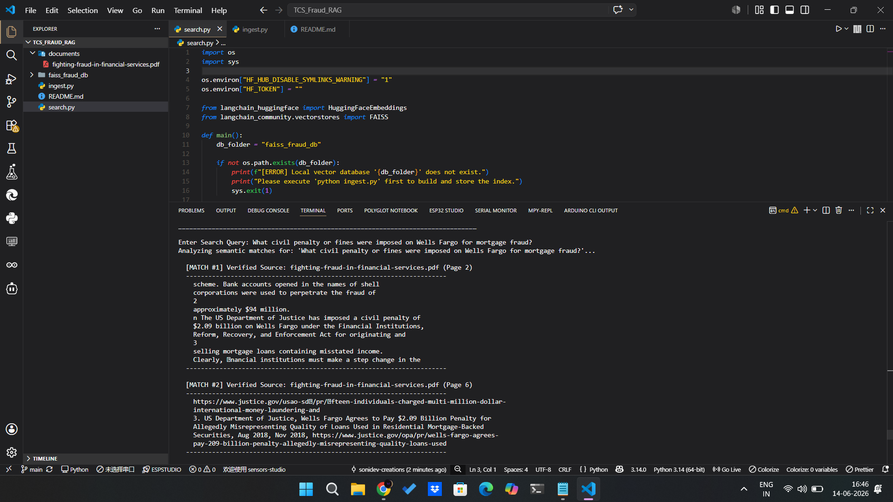

# RAG Document Ingestion Pipeline

A professional AI search engine that reads a physical financial fraud PDF report, converts it into searchable mathematical vectors, and lets you ask questions interactively through your terminal.

---

### Project Execution Interface


---

## How It Works (The Pipeline Flow)

The project is split into two separate modules so you do not have to process the PDF every time you ask a question:

```text
[ 1. Ingestion Pipeline (ingest.py) ]
Physical PDF File -> Text Extraction -> Paragraph Chunks -> FAISS Database (Saved on disk)

[ 2. Interactive Application (search.py) ]
User Input Query -> FAISS Vector Search -> Terminal Prints Text + Page Citations
```

### Project Structure
- **`documents/`**: Folder containing your physical source document (`fighting-fraud-in-financial-services.pdf`).
- **`faiss_fraud_db/`**: The generated local vector database storage folder.
- **`ingest.py`**: Processes and indexes the text from the PDF file.
- **`search.py`**: Runs the interactive loop application in your terminal to search the database.

---
## Technical Specification & Environment

The system architecture is engineered using a modern AI/ML stack, optimized for low-latency vector operations on local hardware.

### Core Architecture Layers

*   **Development Environment (IDE)**: Visual Studio Code (VS Code) configured for Python environments.
*   **Orchestration Framework**: `LangChain` (`langchain-huggingface`) for managing data pipelines and retrievers.
*   **Parsing Library**: `pypdf` for fast, structure-aware text and metadata extraction from local PDF files.
*   **Embedding Model**: `sentence-transformers/all-MiniLM-L6-v2` generating 384-dimensional dense mathematical vectors.
*   **Vector Store Database**: `FAISS` (Facebook AI Similarity Search) optimized for high-speed clustering and similarity matching.

### Configuration & Chunk Parameters

To maximize semantic coherence and retrieval precision, documents are parsed using the following specialized parameters:

*   **Chunk Size**: `450` characters per block.
*   **Chunk Overlap**: `50` characters of sliding window overlap to maintain contextual continuity across splits.
*   **Environment Configuration**: Configured via the native Python `os` module to suppress framework noise (e.g., forcing `HF_HUB_DISABLE_SYMLINKS_WARNING=1` to ensure a clean terminal interface).

### Package Management & Deployment

*   **Dependency Management**: `pip` (Python package installer) paired with a structured `requirements.txt`.
*   **Version Control**: Distributed tracking, staging, commits, and remote hosting managed via Git and GitHub.

---

## Setup and Running Instructions

Follow these terminal steps to set up and run the engine:

### 1. Install Dependencies
```bash
pip install pypdf langchain-huggingface langchain-community faiss-cpu sentence-transformers
```

### 2. Build the Database
Run the ingestion script to parse your PDF file and compile the local FAISS index:
```bash
python ingest.py
```

### 3. Run the Search App
Launch the interactive terminal search prompt:
```bash
python search.py
```

---

## Sample Queries to Try

Once the app is running, paste these queries into the terminal to test the system:
- *"What civil penalty or fines were imposed on Wells Fargo for mortgage fraud?"*
- *"What are the key trends driving next-gen approaches in fraud detection?"*

*(Type `exit` to quit the interactive search application).*

`
